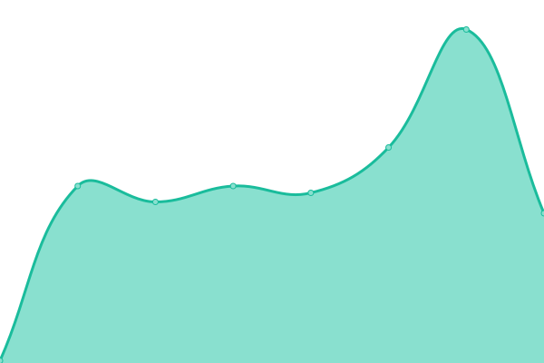
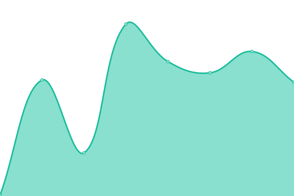
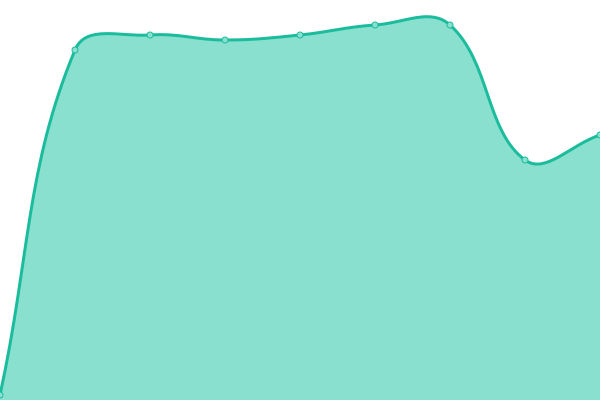
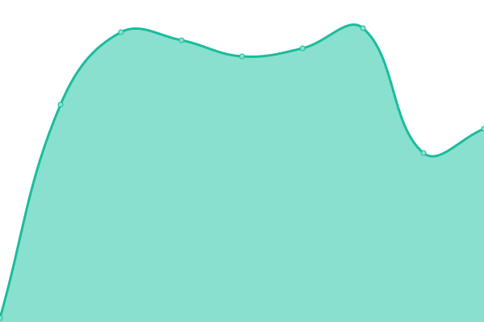

# [📈 Live Status](https://status.jbeard.dev): <!--live status--> **🟩 All systems operational**

This repository contains the open-source uptime monitor and status page for [Upptime](https://upptime.js.org), powered by [Upptime](https://github.com/upptime/upptime).

With [Upptime](https://upptime.js.org), you can get your own unlimited and free uptime monitor and status page, powered entirely by a GitHub repository. We use [Issues](https://github.com/upptime/upptime/issues) as incident reports, [Actions](https://github.com/joshbeard/jbeard-upptime/actions) as uptime monitors, and [Pages](https://status.jbeard.dev) for the status page.

<!--start: status pages-->
<!-- This summary is generated by Upptime (https://github.com/upptime/upptime) -->
<!-- Do not edit this manually, your changes will be overwritten -->
<!-- prettier-ignore -->
| URL | Status | History | Response Time | Uptime |
| --- | ------ | ------- | ------------- | ------ |
|  [joshbeard.me](https://joshbeard.me) | 🟩 Up | [joshbeard-me.yml](https://github.com/joshbeard/jbeard-upptime/commits/HEAD/history/joshbeard-me.yml) | 

 124ms
     
 | 

<a href="https://joshbeard.github.io/jbeard-upptime/history/joshbeard-me">100.00%</a>
    

|  [home.jbeard.dev](https://home.jbeard.dev) | 🟩 Up | [home-jbeard-dev.yml](https://github.com/joshbeard/jbeard-upptime/commits/HEAD/history/home-jbeard-dev.yml) | 

 391ms
     
 | 

<a href="https://joshbeard.github.io/jbeard-upptime/history/home-jbeard-dev">100.00%</a>
    

|  [jbeard.co](https://jbeard.co) | 🟩 Up | [jbeard-co.yml](https://github.com/joshbeard/jbeard-upptime/commits/HEAD/history/jbeard-co.yml) | 

 302ms
     
 | 

<a href="https://joshbeard.github.io/jbeard-upptime/history/jbeard-co">54.26%</a>
    

|  [jbeard.org](https://jbeard.org) | 🟩 Up | [jbeard-org.yml](https://github.com/joshbeard/jbeard-upptime/commits/HEAD/history/jbeard-org.yml) | 

 198ms
     
 | 

<a href="https://joshbeard.github.io/jbeard-upptime/history/jbeard-org">100.00%</a>
    

|  [resume](https://joshbeard.me/resume/) | 🟩 Up | [resume.yml](https://github.com/joshbeard/jbeard-upptime/commits/HEAD/history/resume.yml) | 

 44ms
     
 | 

<a href="https://joshbeard.github.io/jbeard-upptime/history/resume">100.00%</a>
    

|  [gemini-jbeard.co](jbeard.co) | 🟩 Up | [gemini-jbeard-co.yml](https://github.com/joshbeard/jbeard-upptime/commits/HEAD/history/gemini-jbeard-co.yml) | 

 70ms
     
 | 

<a href="https://joshbeard.github.io/jbeard-upptime/history/gemini-jbeard-co">100.00%</a>
    

|  [gopher-jbeard.co](jbeard.co) | 🟩 Up | [gopher-jbeard-co.yml](https://github.com/joshbeard/jbeard-upptime/commits/HEAD/history/gopher-jbeard-co.yml) | 

 71ms
     
 | 

<a href="https://joshbeard.github.io/jbeard-upptime/history/gopher-jbeard-co">100.00%</a>
    

|  [finger-jbeard.co](jbeard.co) | 🟩 Up | [finger-jbeard-co.yml](https://github.com/joshbeard/jbeard-upptime/commits/HEAD/history/finger-jbeard-co.yml) | 

 70ms
     
 | 

<a href="https://joshbeard.github.io/jbeard-upptime/history/finger-jbeard-co">100.00%</a>
    

<!--end: status pages-->

[**Visit our status website →**](https://status.jbeard.dev)

## 📄 License

- Powered by: [Upptime](https://github.com/upptime/upptime)
- Code: [MIT](./LICENSE) © [Upptime](https://upptime.js.org)
- Data in the `./history` directory: [Open Database License](https://opendatacommons.org/licenses/odbl/1-0/)
